# About Us

We are building a bigger tent for nonbinary Jews through a third-gender grammar systematics for Hebrew, guided by our Torah and Talmud that teach us to rejoice that which cannot be neatly categorized.

This project is free, open-source, community-based, and grassroots.
It lives and grows and changes with every single person who uses and adds to it.
Thank you to all the amazing people who are enlivening this work through speaking it into ever-renewed becoming!
Deep gratitude to Tal Klausner, Rabbi Jonah Rank, brin solomon, Rabbi Emily Aviva Kapor-Mater, Ze'evi Berman, and so many more.

## Who We Are

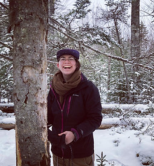
 (they/them/theirs) is a connector who applies their knowledge of ecology as a framework
for justice through building critical community connections and fostering diversity
for resilience through education.

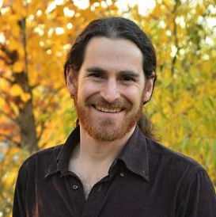
 (he/him/his) is an instructor in the Jewish Studies Program at the University of
Colorado Boulder, as well as a musician and love warrior. [Learn More about Eyal](https://www.colorado.edu/jewishstudies/faculty-and-staff/faculty/eyal-rivlin)

## How to Cite Us

We are so excited that you are using the Nonbinary Hebrew Project's grammatical system
in your work!
We want you to use this project and it is free to use.
Please cite our work, so that folks who use your work can find our website and perhaps make works of their own!
Here's a blurb you can copy and paste:

> "This project uses a gender-expansive Hebrew grammatical system developed by the Nonbinary Hebrew Project.
> For more information, please visit www.nonbinaryhebrew.com "

## Contact Form

Want to say hi?
Have a question?
Need help with a project
you're working on?
Want to share something you've created?
Please use the Contact Box below
to get in touch!

## In the News

[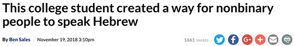](https://www.jta.org/2018/11/19/life-religion/college-student-created-way-transgender-people-speak-hebrew)

[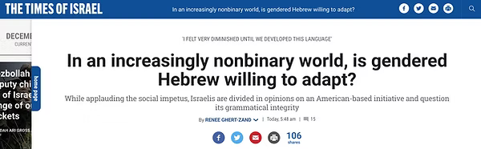](https://www.timesofisrael.com/in-an-increasingly-nonbinary-world-is-gendered-hebrew-willing-to-adapt/)

[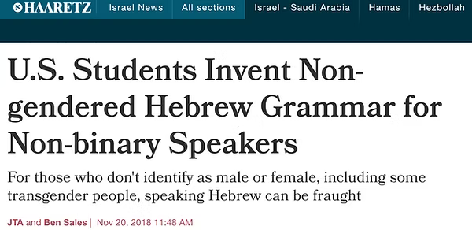](https://www.haaretz.com/us-news/u-s-students-invent-new-hebrew-grammar-for-non-binary-speakers-1.6673572)

[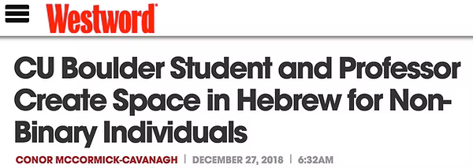](https://www.westword.com/news/cu-boulder-student-and-professor-create-space-in-hebrew-for-non-binary-individuals-11062930)

[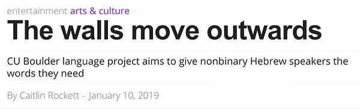](https://www.boulderweekly.com/entertainment/the-walls-move-outwards/)

[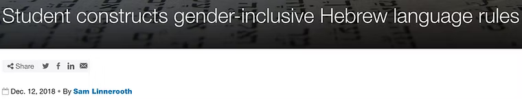](https://www.colorado.edu/today/2018/12/12/student-constructs-gender-inclusive-hebrew-language-rules?fbclid=IwAR0alMpE7-h7Y-fkk8U5Ln9uGoc4XFVbrBhf4eaGGjqXBKUDSJDxjqL2tpU)

[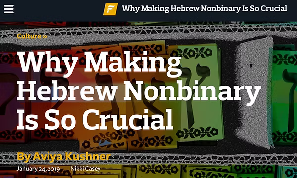](https://forward.com/culture/417978/why-making-hebrew-nonbinary-is-so-crucial/)

[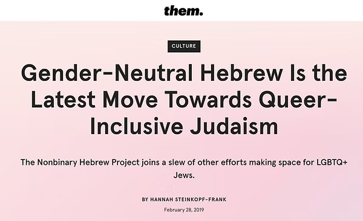](https://www.them.us/story/queer-inclusive-judaism)

[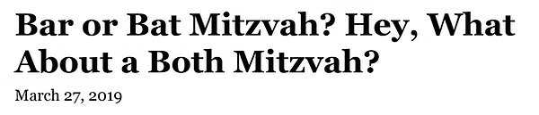](https://www.nytimes.com/2019/03/27/style/gender-fluid-bar-bat-mitzvah.html)

[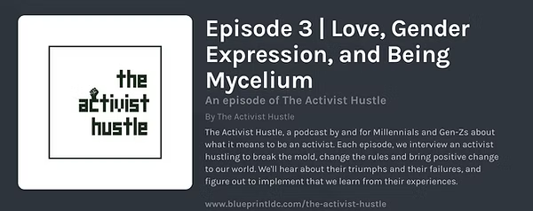](https://anchor.fm/the-activist-hustle/episodes/Episode-3--Love--Gender-Expression--and-Being-Mycelium-e3cc85)

<iframe
  src="https://creators.spotify.com/pod/show/the-activist-hustle/embed/episodes/Episode-3--Love--Gender-Expression--and-Being-Mycelium-e3cc85/a-abaj1u"
  height="102px"
  width="400px"
  frameborder="0"
  scrolling="no"
></iframe>

<iframe
  src="https://creators.spotify.com/pod/show/dearqueers/embed/episodes/Dear-Judaism-with-Lior-Gross--Eyal-Rivlin-from-The-Nonbinary-Hebrew-Project-ememnh/a-a3rag18"
  height="102px"
  width="400px"
  frameborder="0"
  scrolling="no"
></iframe>

[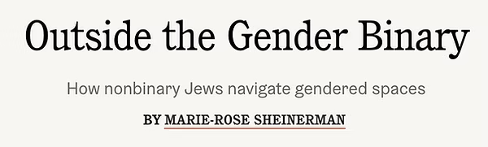](https://www.tabletmag.com/sections/community/articles/outside-the-gender-binary)
