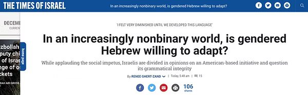
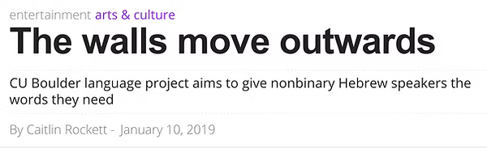
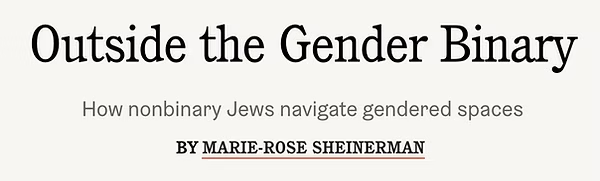

The Nonbinary Hebrew Project has been featured in over a dozen articles and podcasts from outlets like Them, The New York Times, The Washington Post, The Times of Israel, Haaretz, Forward, and more. 

## In the News

<iframe
  src="https://creators.spotify.com/pod/show/the-activist-hustle/embed/episodes/Episode-3--Love--Gender-Expression--and-Being-Mycelium-e3cc85/a-abaj1u"
  height="102px"
  width="400px"
  frameborder="0"
  scrolling="no"
></iframe>

<iframe
  src="https://creators.spotify.com/pod/show/dearqueers/embed/episodes/Dear-Judaism-with-Lior-Gross--Eyal-Rivlin-from-The-Nonbinary-Hebrew-Project-ememnh/a-a3rag18"
  height="102px"
  width="400px"
  frameborder="0"
  scrolling="no"
></iframe>

[The Wind Podcast: They/them](https://thewind.org/episodes/theythem)

[How society is redefining gender](https://www.colorado.edu/today/2019/07/22/transcript-how-society-redefining-gender)

[Reform Judaism: 7 Jewish endeavors make 5782 a Sweet New Year](https://reformjudaism.org/blog/7-jewish-endeavors-make-5782-sweet-new-year)

[Reuters](https://www.reuters.com/graphics/GENDER-LANGUAGE/LGBT/mopanqoelva/)

## Citations to our project

[OpenSiddur: Siddur Masorti](https://opensiddur.org/compilations/liturgical/siddurim/weekday-siddur/siddur-masorti-2019/)

[New York Times: The Gender Binary in Language Classes](https://www.nytimes.com/2021/09/01/crosswords/gender-language-nonbinary.html)

[Reconstructing Judaism](https://evolve.reconstructingjudaism.org/pronouns/#disqus_thread)

[Tablet Magazine: My Nonbinary Journey](https://www.tabletmag.com/sections/community/articles/my-nonbinary-journey)

[Tribe12: Gender Diversity Is Divinely Jewish](https://tribe12.org/2021/05/17/gender-diversity-is-divinely-jewish/)

[Everyday Jewish Mom: Gender Neutral Blessing the Children](https://everydayjewishmom.com/2021/06/08/blessing-the-children-gender-neutral/)

[Washington Post: Guide - How gender-neutral language is developing around the world](https://www.washingtonpost.com/world/2019/12/15/guide-how-gender-neutral-language-is-developing-around-world/)

[Ketubah.com](https://ketubah.com/introducing-non-binary-ketubah-texts/)

[Equal Eyes: Gender neutral Hebrew is the latest move towards Queer Inclusive Judaism](https://equal-eyes.org/database/2019/3/2/gender-neutral-hebrew-is-the-latest-move-towards-queer-inclusive-judaism)

[Wikipedia](https://en.wikipedia.org/wiki/Gender_neutrality_in_languages_with_grammatical_gender#Hebrew)

[Queering Religious Heritage: Languages in the era of COVID19 and changes in LGBTQ Jewish language at home, abroad, and online](https://aftercovid.rice.edu/abstract-queering-religious-heritage-languages-in-the-era-of-covid-19-changes-in-lgbtq-jewish-language-at-home-abroad-and-online/)
